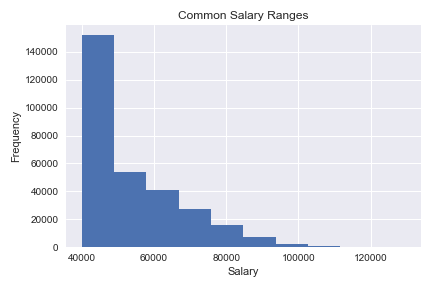
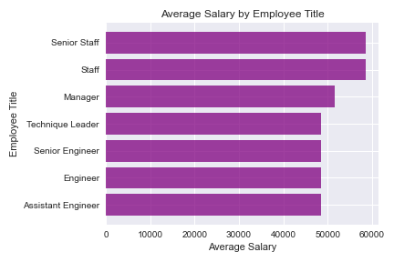

# Data Engineering and Analysis of Employee Data with SQL

The purpose this project is to examine the employee data using SQL.

## Table of Contents 
* [General Info](#General-info)  
* [Technologies](#technologies)  
* [Setup](#setup)  
* [Data Sources](#data-sources)
* [Images](#images)  
* [Overview](#overview)  

## General Info
This code is to manage the employee data into databases using SQL. The second part of the code utilized Jupyter Notebook to explore the data using data frames and graphs.  

## Technologies
Project is created with:  
* PostgreSQL 13.1 using PgAdmin 4
* Jupyter Notebook 4.6.3  
* Matplotlib 3.3.2  
* Pandas 1.0.5  

## Setup
To run the PostgreSQL code, you will need to open it in PgAdmin, and the Jupyter Notebook will be needed to run the other files. Psycopg2 will need to be installed as well. 

## Data Sources 
The data used is provided as csv files in the Data_Files folder in the Employee_SQL folder. 

## Images
ERD for the databases in SQL
  
  
Histogram of Common Salary Ranges
  

Average Salary by Employee Title
  

## Overview
The employee data was provided in 6 csv files, and 6 tables were made using SQL. The above ERD has the table organization. There are two SQL files. This first one contains table set up. There are 300,024 employees listed. The employees break down into 7 job titles spread across 9 departments. There are only 24 managers. Those are pulled from the first three tables made (titles, departments, employees). There are three more tables (dept_manager, dept_employees, salaries) that further explore details for all the employees. 

The second SQL files with queries lists several queries made of the data. The data is broken into the employees’ information. Another analyzes the manager details, and one describes the department details for each employee. A couple queries are looking for specific information regarding their names, hire dates, and departments. Please see the SQL file for more information.  

The other two images shown above were made in Jupyter Notebook to show the common salary ranges and the average salary by employee title. In Jupyter Notebook the data was imported from the SQL file, and three of the tables were made into data frames. Only three tables were used because those were the only ones needed for the specific graphs being made. Those three were the titles, employees, and salaries tables. 

Once all the data was imported and formatted, a histogram was made just of the salary frequency. From the graph, you can see that most salaries for employees is in the $40,000 to $50,000 range. The data was then further analyzed to find the average salary per job title which is shown in the third image. From that image, we can see that the averages are somewhat consistent between the bottom four job titles. The top two are about the same as well but with a moderate increase over the others. For more details on the graphs please view the Jupyter Notebook file. 

Finally, a search was done to look for an employee with the ID number of 499942. That employee's information is listed as an "April Foolsday."